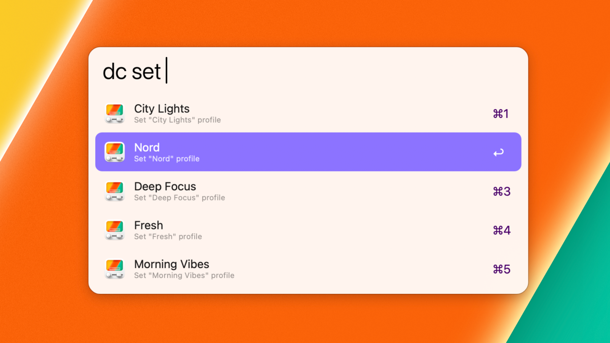

# Desktop Composer Workflow for Alfred

[Desktop Composer](https://www.apptorium.com/desktop-composer) lets you create and manage appearance profiles (themes) for macOS. Change app themes, wallpapers, accent and folder colors, Dock preferences, and more – in one place, with a single click.

[Alfred](https://www.alfredapp.com) is a powerful app that looks like Spotlight but
has far more features. Besides searching, it offers hotkeys, keywords, text expansions and more.

This workflow lets you quickly switch or create profiles in Desktop Composer — right from Alfred.



## Applying a Profile (Theme)
```
dc set [profile-name]
```

## Creating New Profiles
```
dc new [profile-name]
```
